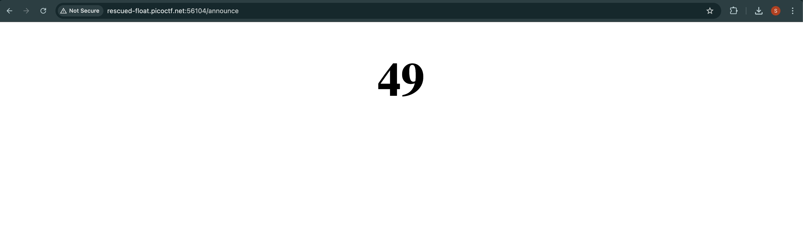

# picoCTF SSTI1 Challenge Write-up  

## Challenge Description  

This challenge involves identifying and exploiting a **Server-Side Template Injection (SSTI)** vulnerability in a web application. Our goal is to manipulate the template engine to extract sensitive data.  

## Steps to Solve the Challenge  

### 1. Start the Instance  

First, start the instance provided in the challenge:  

  

Once the instance is running, open the website in your browser.  

### 2. Analyzing the Web Application  

When we visit the website, we see an input field where we can submit an announcement:  

  

The challenge hint refers to **SSTI**, so we begin by testing for **template injection**.  

### 3. Testing for SSTI  

A common way to check for SSTI is by injecting `{{7*7}}`. If the template engine evaluates this input, it will return `49`.  

I entered:  

```
{{7*7}}
```  

After submitting, the browser redirected me to a new directory and displayed the result:  

  

This confirms that the application is vulnerable to **Server-Side Template Injection**.  

### 4. Identifying the Template Engine  

To determine the template engine being used, we can look at the response headers. The server is identified as `Werkzeug/3.0.3 Python/3.8.10`, which strongly suggests **Jinja2** is in use.  

### 5. Exploring Application Configuration  

Next, we can try extracting the application configuration using:  

```
{{config.items()}}
```  

This can reveal sensitive information about the application’s settings.  

### 6. Accessing Python Built-ins  

By leveraging SSTI, we can access Python's built-in functions:  

```
{{self.__init__.__globals__.__builtins__}}
```  

This exposes functions like `open`, which we can use to read files.  

### 7. Reading the Flag  

Finally, to read the contents of the flag file, we execute:  

```
{{self.__init__.__globals__.__builtins__.open('flag.txt').read()}}
```  

Executing this payload successfully reveals the **flag**. 🎉  

---

## Conclusion  

This challenge demonstrated how an **SSTI vulnerability** can be exploited in a Python web application using Jinja2. By carefully crafting payloads, we were able to access built-in functions and retrieve sensitive information.  